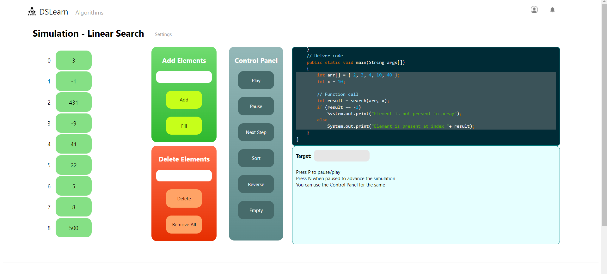
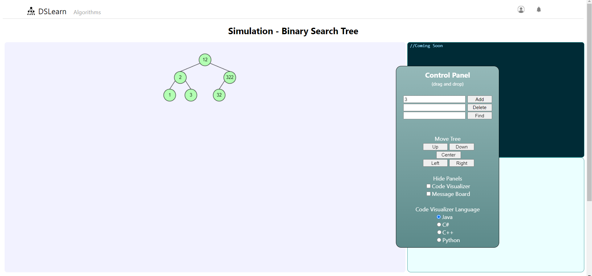

# DSLearn

Simulation based learning environment for Data structures and algorithms.
All the juicy stuff is on the 'Algorithms' page
=======
# DSLearn

Simulation based learning environment for Data structures and algorithms. 
All the juicy stuff is on the 'Algorithms' page.  
http://learn-ds.herokuapp.com/

### Simulation examples

Linear Search

Binary Search Tree

Towers of Hanoi

>>>>>>> 74b406d216beb3133f693ffa66f1410de895273b
